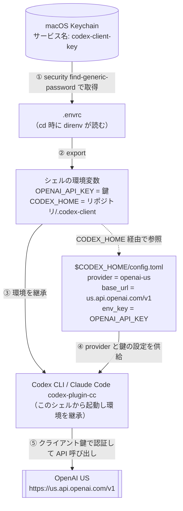
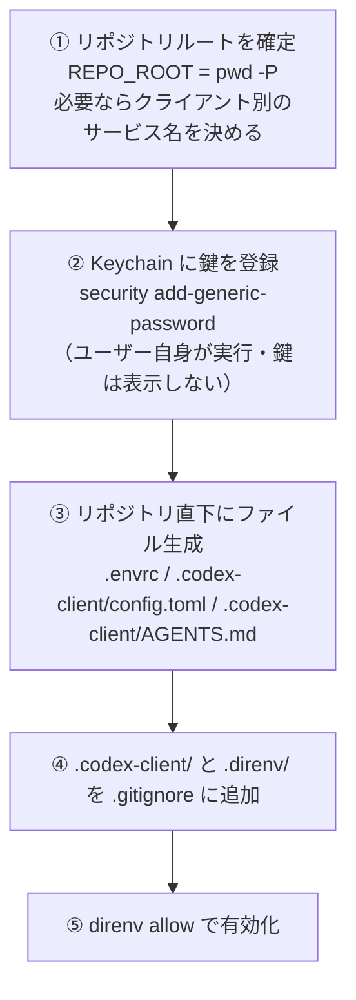

# codex-key-bootstrap（日本語解説）

クライアントから提供された **OpenAI API キー**を、macOS の Keychain・[direnv](https://direnv.net)・リポジトリ単位の `CODEX_HOME` を組み合わせて、**そのリポジトリの中だけで安全に使う**ためのセットアップ／監査 skill です。生の鍵をファイルに書かず、リポジトリごとに別のクライアント鍵を切り替えられます。

> モデル（Claude Code 等のコーディングエージェント）が実行する指示書は [`SKILL.md`](SKILL.md)（英語）です。こちらは人間向けの日本語解説で、**鍵がどう流れるか**を図で示します。

## 何をする skill か

- 生の API キーは **macOS Keychain だけ**に置く（`.env` / `.envrc` / TOML などには絶対に書かない）。
- Codex の設定をリポジトリ単位にスコープする（`CODEX_HOME=<リポジトリ>/.codex-client`）。
- [OpenAI US エンドポイント](https://us.api.openai.com/v1) を使う。
- Codex CLI と Claude Code の公式 `codex-plugin-cc` が、同じ環境・設定をそのまま継承する。
- 1 台のマシンで複数クライアントの鍵を、Keychain のサービス名を分けて共存させられる。

## これは Claude Code 専用ではない

[Agent Skill](https://agentskills.io)（gh skill 互換）なので、**Claude Code / GitHub Copilot / Cursor などマルチエージェント**で使えます。Claude Code 専用ではありません。

- この skill が設定するのは **Codex CLI の認証環境**（Keychain＋direnv＋`CODEX_HOME`）。**実行したエージェントが何であれ Codex 単体に効く**＝Claude Code とは独立です。
- Claude Code 固有なのは「前提」の `codex-plugin-cc` 導入と「確認方法」の `/codex:setup` だけ（**任意の追加ステップ**）。コアの鍵設定は agent 非依存です。
- 非 Claude Code エージェント（Copilot / Cursor 等）では、検証は `codex doctor` と Codex CLI の `/status` で行ってください（`/codex:setup` は Claude Code 専用）。

## 前提・依存（macOS 専用。無ければ公式の方法でインストール）

実行する前に以下が要ります（足りなければ skill が公式の方法で導入を案内/実行します）。

- **クライアントから生鍵を入手済み**であること。**この skill は鍵を発行しません** ―― クライアントから受け取った OpenAI API キーが手元にある前提です。
- **direnv**: `brew install direnv` で入れ、**`~/.zshrc` に `eval "$(direnv hook zsh)"` を追記**してシェルを開き直す。⚠️ **このフックが無いと `.envrc` が読まれず鍵が一切注入されません（いちばん多い「無言の失敗」）。**
- **Codex CLI**: `command -v codex` で確認。無ければ入れる ―― Homebrew があれば `brew install --cask codex`（おすすめ）、無ければ公式インストーラ `curl -fsSL https://chatgpt.com/codex/install.sh | sh`、npm 派なら `npm install -g @openai/codex`（パッケージは**スコープ付き** `@openai/codex`。無印 `codex` は別物）。確認 `codex --version`。
- **（Claude Code を使う場合のみ）`codex-plugin-cc`**: Claude Code 用の公式 Codex 連携。**プラグイン名は `codex@openai-codex`**、その**配布元 marketplace が `openai/codex-plugin-cc`** です（`/plugin marketplace add openai/codex-plugin-cc` → `/plugin install codex@openai-codex`）。Codex CLI 単体で使うなら不要。

## 仕組み（実行時の鍵の流れ）

設定済みリポジトリに `cd` してシェルを開くと、direnv が `.envrc` を読み、Keychain の鍵を環境変数に載せます。その環境を継承して起動した Codex / Claude Code が、OpenAI US に対してクライアント鍵で認証します。



## セットアップの流れ

`/codex-key-bootstrap` を対象リポジトリのルートで呼ぶと、次の順で進みます。鍵の登録（②）だけはユーザー自身が手で実行します（skill は鍵を表示・代行入力しません）。



鍵の登録（②）は **あなたが手で** 実行します（skill は鍵を表示・代行入力しません）。既定のサービス名 `codex-client-key` で登録する例:

```sh
printf 'Client OpenAI API key (入力は非表示): '
read -rs OPENAI_KEY; echo
security add-generic-password -U -a "$USER" -s codex-client-key -w "$OPENAI_KEY"
unset OPENAI_KEY
```

クライアントが複数なら `-s codex-client-key-<クライアント名>` のように分け、その名前を `CLIENT_KEY_SERVICE` に設定します。残りの ①③④⑤ は skill が実行します。

## 重要: 認証はリポジトリ単位でしか効かない

鍵が有効になるのは、**`.envrc` が読まれたシェル（＝設定済みリポジトリの中）だけ**です。

- そのリポジトリの外では、Codex は通常の ChatGPT サブスクリプションのまま。skill を入れただけでは認証は切り替わりません。
- Claude Code / Codex は**起動時のシェル環境を固定**します。設定済みリポジトリで `cd` → `direnv` が効いた状態から起動し直してください（起動中のプロセスは環境変更を拾いません）。

## Codex のどの面（CLI / IDE / app）で効くか

この仕組みは direnv がシェルに入れた環境変数に依存するため、**ツールをどう起動したか**で結果が変わります。

| 面 | クライアント鍵が効くか |
| --- | --- |
| **Codex CLI** | ✅ direnv が効いたシェルで実行すれば効く（基本はこれ）|
| **Claude Code（codex-plugin-cc）** | ✅ direnv ロード済みシェルから起動した Claude Code なら効く（内部で Codex CLI を使うため）|
| **IDE 拡張**（VS Code 等）| ⚠️ direnv ロード済みシェルから IDE を起動したときだけ |
| **Codex デスクトップ app（GUI）** | ❌ ディレクトリを開いても効かない（下記。要ディスク永続化）|
| ChatGPT / cloud | ❌ ローカル設定を一切見ない（別系統）|

### デスクトップ app（GUI）は要注意 — ディレクトリを開いても効かない

Codex デスクトップ app は対象ディレクトリを開いて使いますが、**設定済みリポジトリを開いてもクライアント鍵は効きません**（実機のキャプチャでも、app セッションは `OPENAI_API_KEY`/`CODEX_HOME` が未設定＝ChatGPT 認証で動いていました）。

理由: app の中でディレクトリを開く操作は **direnv を起動しません**（app はシェルではなく、`.envrc` は読まれない）。鍵は direnv が**シェルに**注入する環境変数なので、GUI で開いただけの app には渡らず、`~/.codex` にフォールバック → **ChatGPT サブスクのまま**動きます。macOS の GUI アプリは launchd の環境を継承し、ターミナルで direnv が入れた `OPENAI_API_KEY`/`CODEX_HOME` を見ない、というのが根本原因です。

- `open -a Codex .` をターミナルから打てば呼び出しシェルの env を転送する「はず」ですが、これが効くのは **app の新規（コールド）起動時のみ**。既に起動中の app には `open` は env を渡さず前面化するだけです。実機でも当てにならなかったので**当てにしないでください**。
- app でどうしてもクライアント鍵を使うなら、確実なのは**ディスクに鍵を永続化**する `codex login --with-api-key` だけです（ただし `auth.json` は `CODEX_HOME` 単位でグローバルになり、リポジトリ単位の分離は崩れる）。

**結論: クライアント鍵を使う作業は CLI で行う**（CLI なら direnv が効く）。デスクトップ app は、ディスク永続化しない限り「ChatGPT 側」として扱うのが安全です。

> クライアント業務では「どの認証で動いているか」が**データの扱い**に直結します。app が黙って ChatGPT 側にフォールバックしていると、クライアントのコードが自分の ChatGPT アカウント経由で処理されることになります。作業前に下の「確認方法」で認証元を確かめてください。

## 確認方法（鍵を表示せずに）

設定済みリポジトリのルートで実行します。

```sh
# 環境とファイルが揃っているか
direnv exec . zsh -c 'test -n "$OPENAI_API_KEY" && test "$CODEX_HOME" = "$(pwd -P)/.codex-client" && echo ok'

# クライアント鍵で認証しているか（サブスクではないか）
codex doctor
```

`codex doctor` が `default model provider openai-us` / `provider name OpenAI (US)` / `provider auth env var OPENAI_API_KEY (present)` を出せば鍵経由です（サブスクなら `stored auth mode chatgpt`）。詳しい検証・監査・トラブルシュートは [`SKILL.md`](SKILL.md) を参照してください。

## 楽したいとき: 親ディレクトリ方式（時短オプション）

各リポジトリで設定するのが基本（per-repo）ですが、**1 つのクライアント専用の親ディレクトリ**（配下が全部同じクライアント・同じ鍵でよい）なら、親に `.envrc` を 1 枚置いて配下に効かせる時短もできます。

- direnv は `$PWD` から上に辿って**最初に見つかった `.envrc` 1 枚だけ**を読みます。子に自前の `.envrc` が無ければ、最も近い親の `.envrc` を自動で継承します（＝子リポごとの設定が不要）。
- ただし: 親の `.envrc` 内で `$(pwd -P)` は**親ディレクトリに解決**されるため、`CODEX_HOME=$(pwd -P)/.codex-client` は配下で**1 つの共有 home に collapse**します（リポジトリ単位の分離にはならない）。同じ鍵・同じプロバイダで揃うなら共有で問題ありません。
- 子リポに自前の `.envrc` を置くと、`source_up`（親 `.envrc` も読む direnv 指示）を書かない限り親は読まれません。

| | per-repo（既定・推奨）| 親ディレクトリ cascade（時短）|
| --- | --- | --- |
| 設定の手間 | リポごとに 1 回（skill が自動化）| 親に 1 枚で配下に効く |
| 鍵の影響範囲 | そのリポだけ（小さい）| 親配下の全リポ（広い）|
| 複数クライアント | サービス名を分けて共存 | 親が 1 クライアント専用ならOK |
| `CODEX_HOME` | リポごとに独立 | 共有 1 つに collapse |

**使い分け**: 分離・監査を重視するなら per-repo。「この親は完全に 1 クライアント専用」と割り切れて手間を減らしたいなら親 cascade（共有 `CODEX_HOME` を受容）。GUI app の注意は**どちらの方式でも同じ**（鍵の置き場所ではなく env 継承の問題）。
