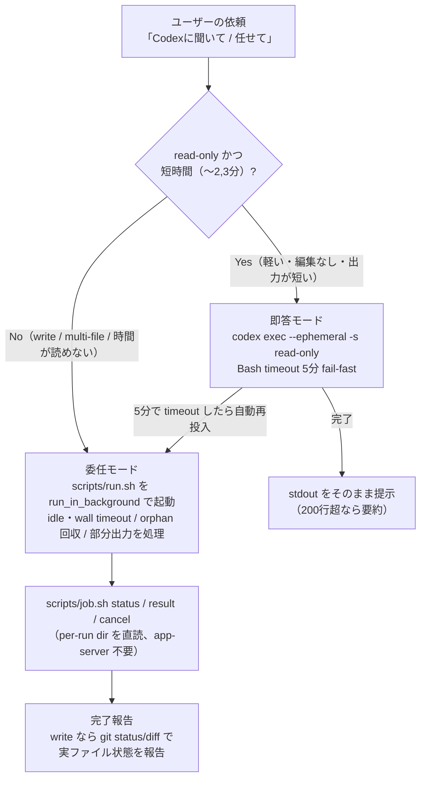

# codex（日本語解説）

Claude Code から OpenAI [Codex CLI](https://developers.openai.com/codex)（`codex exec`）を呼ぶ skill です。**即答モード（フォアグラウンド・軽量クエリ）** と **委任モード（バックグラウンド・長時間委任）** を依頼内容から自動で使い分けます。

> モデルが実行する指示は [`SKILL.md`](SKILL.md)。CLI の詳細仕様は [`references/cli-reference.md`](references/cli-reference.md)、活用パターンは [`references/use-cases.md`](references/use-cases.md)。こちらは人間向けの日本語解説＋図です。
>
> （補足：SKILL.md やスクリプト内では即答モードを `fg`、委任モードを `bg`（UNIX の foreground/background）と略記しています。意味は同じです。）

## 何をする skill か

- 「Codexに聞いて」「ファクトチェックして」「web検索して」「セカンドオピニオン」→ **即答モード**（read-only・数秒〜数分で即答）
- 「Codexに任せて」「Codexでリファクタして」「大規模調査」→ **委任モード**（write 可・長時間。Bash tool の 10 分制限を回避）
- Bedrock 版 Claude Code では `WebSearch` の代替にもなる（即答モード ＋ `web_search=live`）

## 自動ルーティング（どちらのモードになるか）

実行前に「モード / sandbox / 想定時間」を 1 行提示してから動きます。迷ったら委任モード（重いタスクを即答モードで回して 10 分制限に被弾する損失の方が大きいため）。



## 即答モードと委任モードの違い

| | 即答モード（フォアグラウンド） | 委任モード（バックグラウンド） |
| --- | --- | --- |
| 用途 | web検索・ファクトチェック・Q&A・セカンドオピニオン | リファクタ・実装修正・レビュー・大規模調査 |
| 書き込み | read-only のみ | `workspace-write` 可 |
| 実行 | `codex exec --ephemeral` を直接 | `scripts/run.sh` を `run_in_background` で |
| 時間 | 数秒〜数分（5分で fail-fast → 委任モードへ再投入）| 長時間（idle/wall timeout 付き）|
| 報告 | stdout をそのまま | `job.sh` で状態・結果、write なら実ファイル差分 |

## 委任モードの堅牢性（なぜ独自ラッパーか）

公式 codex-plugin が未解決の **hang / orphan / 部分出力欠落**を、`scripts/run.sh`（親として codex を握り続ける）＋ `scripts/job.sh`（per-run ディレクトリを直読）で構造的に解消しています。`status` が `completed` 以外（`failed`/`timed_out`/`cancelled`/`orphaned`）なら、成功を装わず部分出力で正直に報告します。

## 委任モードの write の安全範囲

既定は `read-only` で、`workspace-write` になるのは「リファクタして」「修正して」など**明示的に変更を依頼したときだけ**。`workspace-write` はワークツリー内の編集とローカルコマンド実行を許すモードで、この skill の運用では **commit / push は依頼せず**、完了後に Claude が `git status` / `git diff --stat` で**実ファイルの差分**を報告するに留めます（Codex の自己申告は信用しない）。気に入らなければ `git restore` / `git checkout` で戻せます。

なお厳密には、`git commit` はローカル操作なので sandbox だけで常に禁止されるわけではありません（モデルが実行しうる）。一方 `git push` は既定の `network_access=false` で実質ブロックされます。commit/push を**確実に**禁じたいチームは、Codex の rules（`~/.codex` / リポの execpolicy）で `git commit` / `git push` / `gh` を deny に設定してください。

## 公式 codex-plugin との使い分け

OpenAI 公式の codex-plugin（`/codex:rescue` 等）と**併用できます**（namespace が違うので衝突しない）。迷ったらこの `codex`（`/j-stack:codex`）を使えば OK。使い分けの目安:

| やりたいこと | 使うもの |
| --- | --- |
| 長時間の委任で**タイムアウト/ハング/orphan を避けたい** | この `codex`（委任モード。公式が未解決の弱点を解消済み） |
| セカンドオピニオン・別 AI の視点・技術 Q&A | この `codex`（即答モード） |
| web検索・ファクトチェック | まず標準の WebSearch。使えない環境（Bedrock 版等）や「Codexで」明示時にこの `codex`（即答モード） |
| 公式のコードレビュー機能を使いたい | 公式 `/codex:review` |

## 運用（ジョブの確認・ログ・掃除）

委任モードのジョブの状態・成果物・ログは per-run ディレクトリ `~/.local/state/j-stack-codex/runs/<run-id>/` に置かれます（`log.txt`=全出力 / `result.txt`=最終回答 / `status.json`=状態 / `exit`=終了コード）。通常は Claude が `job.sh` 経由で報告するので直接触る必要はありませんが、自分で確認・掃除したいとき:

```bash
S=~/.claude/skills/codex/scripts          # gh skill / user scope の場合
bash $S/job.sh list                       # 全 run の状態一覧
bash $S/job.sh status <run-dir>           # 1件の状態（死んだ running は orphaned に自動補正）
bash $S/job.sh result <run-dir>           # 最終回答（無ければ log 末尾＝部分出力）
bash $S/job.sh cancel <run-dir>           # 実行中ジョブを中断
bash $S/job.sh clean 7                    # 7日より古い「終了済み」run を掃除（実行中は消さない）
```

> run ディレクトリは委任のたびに増えるので、`job.sh clean [日数]` で定期的に掃除してください（既定 7 日、`completed`/`failed`/`timed_out`/`cancelled`/`orphaned` のみ削除、`running`/`queued` は安全のため残す。何が消えるか先に見たいなら `job.sh clean --dry-run`）。
>
> run dir には渡したプロンプト・ログ・結果（`prompt.txt`/`log.txt`/`result.txt`）が平文で残ります。**機密情報をプロンプトに入れない**こと、長期保持しないこと（上記 clean で定期削除）。

> **「web検索して」「ファクトチェックして」等は、WebSearch が使える通常の Claude Code ではまず WebSearch を優先**し、それが無い環境（Bedrock 版など）で Codex にフォールバックします。「Codex で」と明示すれば常に Codex を使います。

## 前提・依存（無ければ公式の方法でインストール）

- **codex CLI**: `command -v codex` で確認。無ければ公式の方法で入れる — Homebrew があれば `brew install --cask codex`、無ければ公式インストーラ `curl -fsSL https://chatgpt.com/codex/install.sh | sh`、npm 派なら `npm install -g @openai/codex`（パッケージは**スコープ付き** `@openai/codex`。無印 `codex` は別物）。確認は `codex --version`。
- **認証**: `codex login` 済み、または `OPENAI_API_KEY` / `CODEX_API_KEY`。未認証なら案内のみ（鍵・ログインの代行はしない）。公式 docs: https://developers.openai.com/codex
