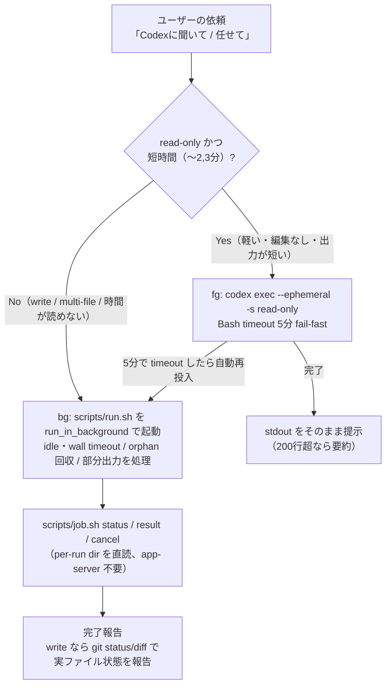

# codex（日本語解説）

Claude Code から OpenAI [Codex CLI](https://developers.openai.com/codex)（`codex exec`）を呼ぶ skill です。**fg（フォアグラウンド軽量クエリ）** と **bg（バックグラウンド長時間委任）** を依頼内容から自動で使い分けます。

> モデルが実行する指示は [`SKILL.md`](SKILL.md)。CLI の詳細仕様は [`references/cli-reference.md`](references/cli-reference.md)、活用パターンは [`references/use-cases.md`](references/use-cases.md)。こちらは人間向けの日本語解説＋図です。

## 何をする skill か

- 「Codexに聞いて」「ファクトチェックして」「web検索して」「セカンドオピニオン」→ **fg**（read-only・数秒〜数分で即答）
- 「Codexに任せて」「Codexでリファクタして」「大規模調査」→ **bg**（write 可・長時間。Bash tool の 10 分制限を回避）
- Bedrock 版 Claude Code では `WebSearch` の代替にもなる（fg ＋ `web_search=live`）

## fg / bg の自動ルーティング

実行前に「mode / sandbox / 想定時間」を 1 行提示してから動きます。迷ったら bg（重いタスクを fg で回して 10 分制限に被弾する損失の方が大きいため）。

## fg と bg の違い

| | fg（フォアグラウンド軽量） | bg（バックグラウンド長時間） |
| --- | --- | --- |
| 用途 | web検索・ファクトチェック・Q&A・セカンドオピニオン | リファクタ・実装修正・レビュー・大規模調査 |
| 書き込み | read-only のみ | `workspace-write` 可 |
| 実行 | `codex exec --ephemeral` を直接 | `scripts/run.sh` を `run_in_background` で |
| 時間 | 数秒〜数分（5分で fail-fast → bg 再投入）| 長時間（idle/wall timeout 付き）|
| 報告 | stdout をそのまま | `job.sh` で状態・結果、write なら実ファイル差分 |

## bg の堅牢性（なぜ独自ラッパーか）

公式 codex-plugin が未解決の **hang / orphan / 部分出力欠落**を、`scripts/run.sh`（親として codex を握り続ける）＋ `scripts/job.sh`（per-run ディレクトリを直読）で構造的に解消しています。`status` が `completed` 以外（`failed`/`timed_out`/`cancelled`/`orphaned`）なら、成功を装わず部分出力で正直に報告します。

## 前提・依存（無ければ公式の方法でインストール）

- **codex CLI**: `command -v codex` で確認。無ければ公式の方法で入れる — Homebrew があれば `brew install --cask codex`、無ければ公式インストーラ `curl -fsSL https://chatgpt.com/codex/install.sh | sh`、npm 派なら `npm install -g @openai/codex`（パッケージは**スコープ付き** `@openai/codex`。無印 `codex` は別物）。確認は `codex --version`。
- **認証**: `codex login` 済み、または `OPENAI_API_KEY` / `CODEX_API_KEY`。未認証なら案内のみ（鍵・ログインの代行はしない）。公式 docs: https://developers.openai.com/codex
