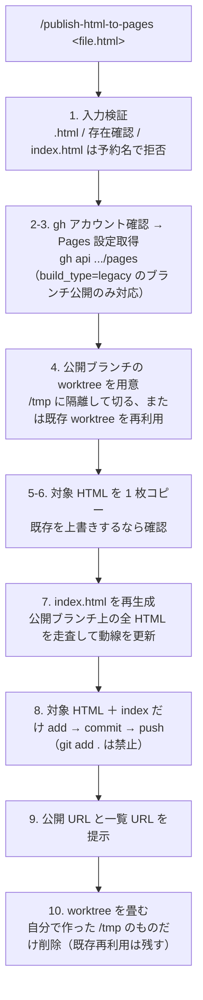

# publish-html-to-pages（日本語解説）

単体の HTML ドキュメント（レビュー資料・設計書 HTML 等）を、実行リポジトリの [GitHub Pages](https://docs.github.com/pages) 公開ブランチ経由で公開する skill です。対象 HTML を **1 ファイルだけ**足し、公開ブランチ上の全 HTML を走査してルートの `index.html`（公開済みドキュメント一覧＝ランディングページ）を再生成し、同じ commit で push します。

> モデルが実行する指示は [`SKILL.md`](SKILL.md)。こちらは人間向けの日本語解説＋図です。push という外向き・実質不可逆な操作を含むため、**モデルからの自動起動は無効**（`disable-model-invocation: true`）。`/publish-html-to-pages <file.html>` を明示的に呼んだときだけ動きます。

## 何をする skill か

- 対象 HTML を公開ブランチ（`review` / `gh-pages` 等、**Pages 設定で決まる**）に 1 枚足して push → Pages の URL で見られる
- push のたびに **ルートの `index.html` を自動再生成**して、過去に公開した資料への動線（ランディングページ）を最新に保つ
- 本リポの作業ツリーや他ブランチの history は触らない（公開ブランチを `/tmp` の専用 worktree に隔離）

## 公開フロー

## 使えない / 注意するケース

- **GitHub Actions ソースの Pages では使えない**（`build_type` が `workflow`）。ブランチに push しても公開されない legacy/branch ソース専用。§3 で判定して止めます。
- 公開元が `/docs` のリポでは、その配下に置きます（配信 URL に `/docs` は付かない）。
- push 後の反映に 1〜2 分のラグあり。
- private リポ・org 制約のある環境では、対象リポに push 権限のあるアカウントが gh の active であること（違えば switch）。

## 前提・依存（無ければ公式の方法でインストール）

- **`gh` CLI**: `command -v gh` で確認。無ければ公式の方法で入れる — `brew install gh`（公式 docs: https://cli.github.com ）。対象リポに push 権限のあるアカウントでログイン済みであること（未ログインなら `gh auth login` を案内）。
- CWD が対象リポジトリ内であること、実行環境が Claude Code で `EnterWorktree` / `ExitWorktree` が使えること。
